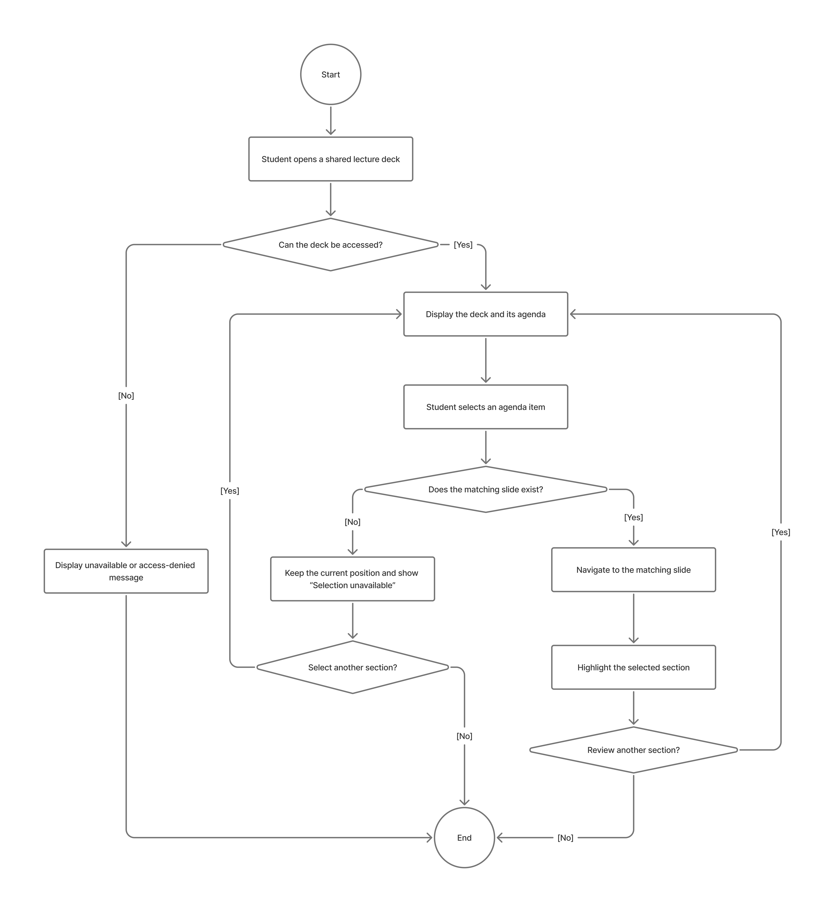

# Specification Phase Exercise

A little exercise to get started with the specification phase of the software development lifecycle. In this exercise, your team specifies a set of improvements and new features for [The Slide Machine](https://theslidemachine.com) — see the [instructions](instructions.md) for detail, and the [background](background.md) for an introduction to the software product you are tasked with extending.

## Team members

See instructions. Delete this line and replace with a list of the names of your team members, including links to each one's GitHub profile.

Lefei Ke (https://github.com/LefeiKe)

## Review of the Current Application

See instructions. Delete this line and replace with your team's findings from using the live app at https://theslidemachine.com — at least 10 specific observations, each labeled as a strength, a weakness, or a gap, and drawn from more than one team member's use of the app.

1. **Weakness — Missing content after pauses in speech:** When delivering a lecture, I noticed that The Slide Machine sometimes failed to capture information after I paused between sentences to think about what to say next. Even though I continued speaking and provided meaningful information afterward, some of that content was not included in the generated slides. This is particularly problematic during live lectures because instructors cannot always speak continuously without pausing to organize their thoughts. I expected the application to preserve all meaningful information communicated after a pause.

2. **Weakness — Inefficient use of slide space:** When generating slides from my spoken lecture, I noticed that the application frequently placed text in only half or less of the available slide space, leaving large empty areas on the page. This occurred repeatedly throughout the generated presentation rather than on only one slide. Although the information remained readable, the layout appeared visually unbalanced and made the slides look less polished.

## Prior Art & Originality

See instructions. Delete this line and replace with a short statement of what your team checked (the project's Future Work and Open Questions, its roadmap, and its open issues and pull requests) and which parts of your proposal are original — new work not already specified, scheduled, or proposed by someone else.

## Stakeholders

See instructions. Delete this line and replace with the name(s) of the stakeholder(s) you interviewed and lists showing their goals/needs, and problems/frustrations. Note which type of user each stakeholder represents. You may use pseudonyms or partial names to maintain their privacy, but you must privately share their full names and contact information as part of your submission of this exercise

## Product Vision Statement

See instructions. Delete this line and place your Product Vision Statement here — one sentence describing the improvements and new features your team is proposing for The Slide Machine.

## User Requirements

See instructions. Delete this line and place a list of your User Stories here, grouped by type of user. These should describe functionality that is new or changed, not functionality the app already has.

## Activity Diagrams

The following UML Activity Diagrams show how presenters and students interact
with the existing Slide Machine workflow and our proposed improvements. Each
diagram includes both successful and unsuccessful paths.

### Presenter

#### Clear Pre-Lecture Instructions

**User story:** As a presenter, I want clear instructions before I begin
lecturing so I can plan more effectively and predict what my slides will look
like.

#### Start a New Slide Without Speaking

**User story:** As a presenter lecturing in class, I want to move to a new slide
without saying a command out loud, so that my class is not distracted and my
lecture keeps its flow.

### Student

#### Jump from an Agenda Item to Its Section

**User story:** As a student reviewing a deck, I want each agenda item to jump
to its matching slide, so that I can find the section I need without starting
from the title slide.

#### Open the Complete Lecture Explanation

**User story:** As a student, I want explanations on the slides to keep their
full meaning instead of being shortened to a few words, so that I can learn
from them without the original lecture.

## Wireframes

See instructions. Delete this line and place your wireframe diagrams here, covering every new screen and every existing screen your proposal changes, for every type of user.

## Clickable Prototype

See instructions. Delete this line and place a publicly-accessible link to your clickable prototype here.

## Stakeholder Demo

See instructions. Delete this line and place a link to the deck The Slide Machine generated during your presentation here, after you have presented.

## Exit Ticket

See instructions. Delete this line and place a link to the exit-ticket quiz you generated from your demo deck and distributed to the class, along with a short note on what — if anything — you had to correct in the generated questions before publishing.
