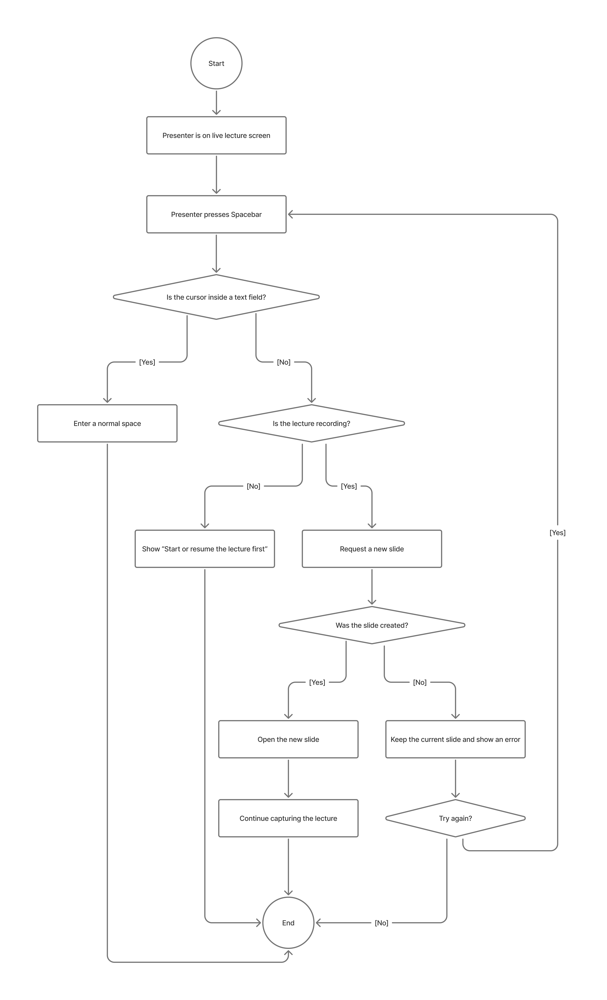
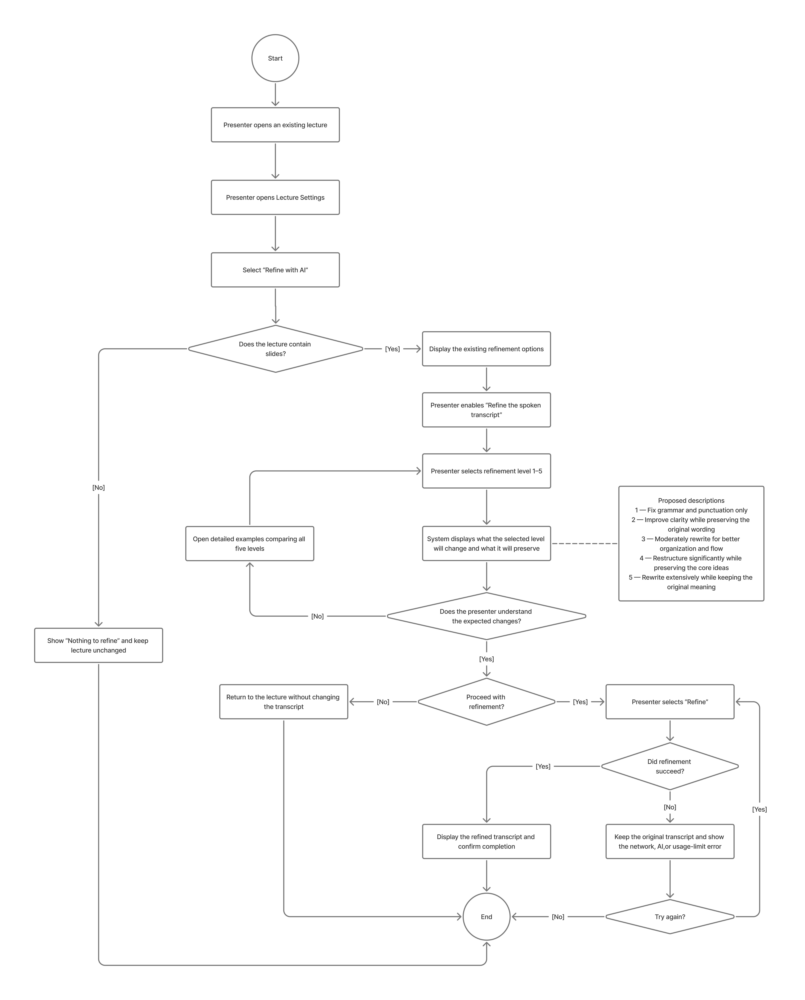
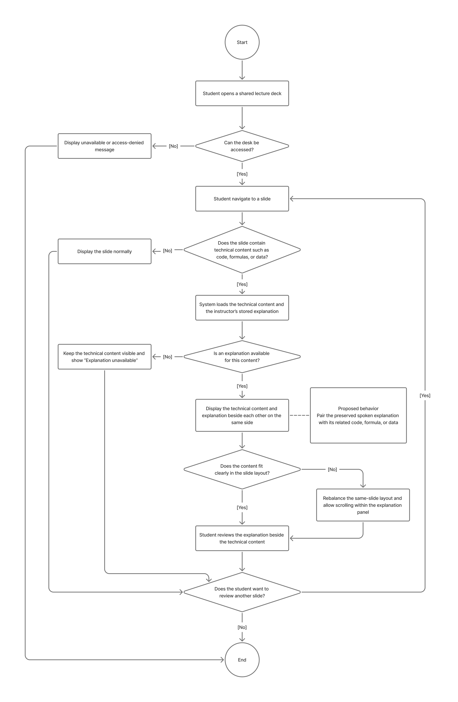
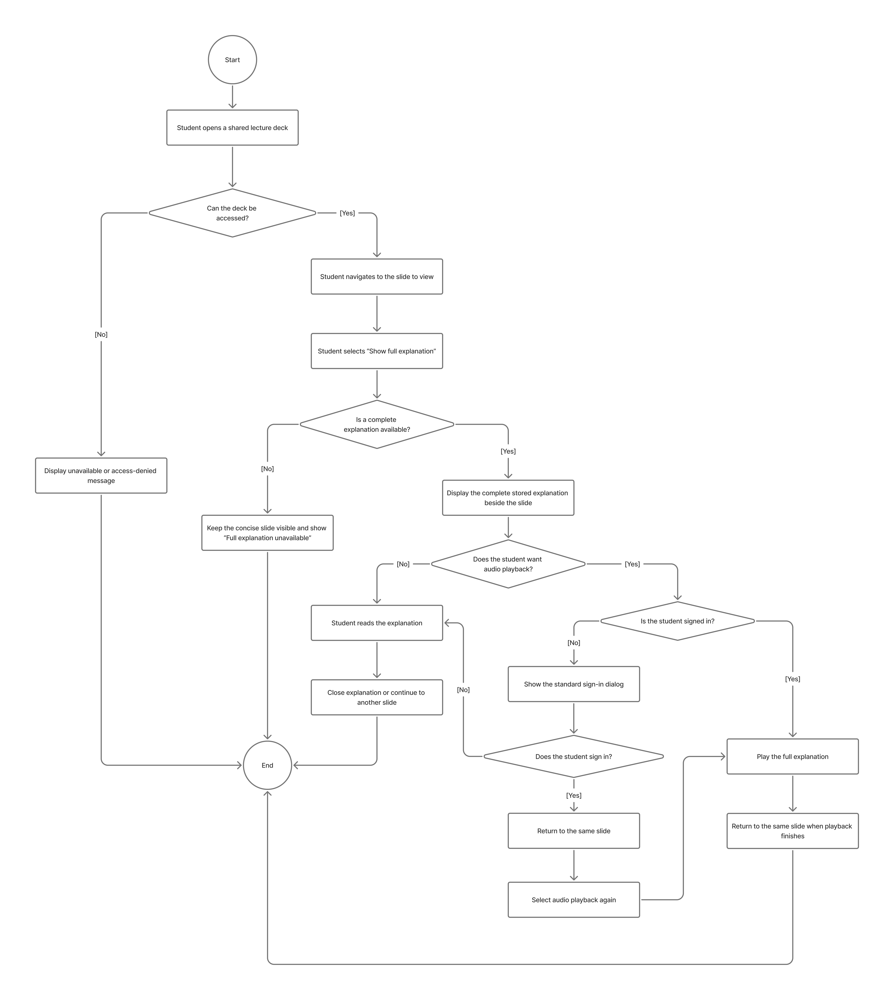

# Specification Phase Exercise

A little exercise to get started with the specification phase of the software development lifecycle. In this exercise, your team specifies a set of improvements and new features for [The Slide Machine](https://theslidemachine.com) — see the [instructions](instructions.md) for detail, and the [background](background.md) for an introduction to the software product you are tasked with extending.

## Team members

- Yasmine Ksiyer (https://github.com/yasminek27)
- Lefei Ke (https://github.com/LefeiKe)
- Sofia Matari (https://github.com/sofia-matari)
- Yazid Alhamed (https://github.com/Dizay-53)
- Angelina Zhu (https://github.com/ange285)

## Review of the Current Application

1. **Weakness — Missing content after pauses in speech:** When delivering a lecture, I noticed that The Slide Machine sometimes failed to capture information after I paused between sentences to think about what to say next. Even though I continued speaking and provided meaningful information afterward, some of that content was not included in the generated slides. This is particularly problematic during live lectures because instructors cannot always speak continuously without pausing to organize their thoughts. I expected the application to preserve all meaningful information communicated after a pause.

2. **Weakness — Inefficient use of slide space:** When generating slides from my spoken lecture, I noticed that the application frequently placed text in only half or less of the available slide space, leaving large empty areas on the page. This occurred repeatedly throughout the generated presentation rather than on only one slide. Although the information remained readable, the layout appeared visually unbalanced and made the slides look less polished.

3. **Weakness - Shortcut Instructions:**  When creating a slideshow, in class it was mentioned that you can say certain things like add a link or add an image but no where on the website does it say where you can do that. There is no list of shortcuts you can say to know what the machine can or cannot do.

4. **Gap - Speaking Feature:** The speaking feature itself does a really good job at picking up the words and displaying them. However, you have to say next slide in order to get it to be a next slide and if this was something a professor or someone wanted to make during class it would ruin the flow. Possibly adding a button feature where if you press a key or a button (EX: spacebar) the system will know that the next set of words need to be placed on a new slide.

5. **Weakness - Focus on technical content:** When discussing code for a time series, the generated slides included only the code details but left out the explanation and content completely. If any explanation is generated, it becomes very concise (which defeats the point of the explanation). 

6. **Weakness - Regenerate from spoken audio:** Regenerate from spoken audio doesn’t seem to do anything. When you edit the spoken transcript and try to regenerate the slide, it just reverts the transcript and the slide doesn’t change. 

7. **Weakness — Inconsistent wording across identical login gates:** Three different toolbar actions on a public shared deck (translate, play the full narration, and "Speak this slide" from the slide's options menu) all require an account, but each one pops a differently-worded modal: "Log in to translate slides," "Log in to play back the lecture," and "Narration needs an account." All three are the same underlying situation (a logged-out viewer hit an AI/audio feature that needs an account), but the copy is inconsistent, which makes the gating feel like three separate bugs rather than one deliberate policy. A single, consistent modal (e.g., always "Log in to use this feature") would read as intentional instead of unfinished.

8. **Weakness — "Share deck" gives no feedback when clicked:** Clicking the "Share deck" icon in the toolbar produces no visible change on screen at al, no confirmation that a link was copied. I expected either a share dialog to open or at least a brief "Link copied" confirmation, the way most apps confirm a share/copy action. As it stands, I can't tell if the click even registered, whether something was silently copied to my clipboard, or whether the feature is broken.

9. **Weakness- Agenda Indexing:** When a slideshow is generated with an Agenda slide, each bullet point in the agenda is generated with purple and underlined text, which makes it appear to the user that it is a hyperlink which will automatically display the first slide corresponding to the agenda bullet upon clicking it. However, when I click each Agenda bullet, it only opens a new tab with the title slide showing everytime. I did not expect the website to perform this way and expected the hyperlink to take me to approximately the correct slide I was looking for. 

10. **Weakness - Refinement of verbal transcript:** Under the “Lecture Settings,” I found the “Refine the spoken transcript” option vague. Despite there being a scale similar to the “AI Freedom” one, I found it unclear because there is no specific description of how exactly the AI will rewrite your spoken narration. If you select “How much: 1,” will only grammar be fixed, or will it change the way the ideas are presented to a minimal extent compared to moving the scale to 4 or 5? A short description explaining what each number on the scale would actually represent would make users feel more comfortable allowing the AI to refine their spoken presentation. 

 ## Prior Art & Originality

We reviewed the Slide Machine’s Future Work and Open Questions, and its roadmap, and its open issues and pull requests, to determine whether our suggested improvement has already been planned. Firstly, the specification covers the “Manual new-slide mode (opt-in),” meaning there is optionality to (instead of letting AI determine whether or not to create a new slide) use a voice command “next slide” to trigger the creation of a new slide. However, our improvement revolves around making this specific function more clear and easier for a user to control. During our testing, we did not find it obvious which mode we were in, whether we had to say “next slide” or the AI would create a new slide itself. We suggest providing clearer instructions before the user begins speaking to outline whether or not the user has to use spoken commands, and if so, what they are. Going even further, this applies to all of the commands included in the specification such as start, stop, pause, rewind, and fast forward, as they were all unclear to us upon our first use of the platform. Additionally, we also suggest adding a keyboard control button (i.e. pressing the spacebar) to trigger the creation of a new slide, or for any of the commands, and making that explicitly clear to the user to offer an easier user experience and more optionality. Secondly, the specification provides various requirements of the formatting of code when spoken into the website, however, there is not much instruction on how the explanation of that code will be integrated. We found that when we lectured about code and provided an explanation to accompany it, the explanation was not really integrated at all into the slideshow, which proved to be a loss of information that significantly degraded the effectiveness of the presentation. Therefore, we plan to improve the gap between the technical, and literal representation of the code and preserve the quality of the explanation which supplements it. Lastly, although the specification mentions the “Refine the spoken transcript” and explains what it does, we were still not sure how much AI enhancement would correspond to each number on the scale, and were hoping we would clarify this to the user in our improvement to integrate AI transparency into the application. Through further specifications of what each number truly represents in terms of AI refinement, this will provide control back to the users regarding the degree of AI-integration into their lectures and presentations. Overall, even though the specification does cover voice commands, slide advancement, the formatting of code content and spoken refinement, our improvements are centered around making the speech input aspect of the application clearer to use for first time users, better visibility of speaking commands, preserving narration supplementing code content, and clear descriptions of what each speech-refinement level will change. These usability improvements are not covered in the provided specification and project materials we examined. 

## Stakeholders

Stakeholder 1: Raviha S. - Pre-med Student
**Goals/Needs:**
- Not engaging material when looking at slides
- Would rather speak then create slides for presentations
- Needs a quick way to get accurate information for slides
- Wants her notes to be converted to slides with related images

**Frustrations:**
- When using the Slide Machine for a gene presentation it could not 
explain data from the graph that it had inserted at her request
- When creating a new slide it skipped a blank slide it created and had 
her information put on to a different slide
- The speak to text feature when needing to edit a slide doesn’t work
- Wanted to add links to different research papers but the slide machine wouldn’t put in links

Stakeholder 2: Omar K. - Elementary School Teacher
**Goals/Needs:**
- Would like to spend less time designing slides for class
- Needs the slides to be easy to follow and engaging for their students
- Has different kinds of learners (visual, auditory, kinesthetic) and needs slides to work for different learning styles
- Would like an activity related to the material taught

**Frustrations:**
- There isn’t enough design control
- There isn’t enough exit ticket control in terms of a difficulty level
- It takes too long to make slides from scratch
- Figuring out how to test students is difficult for each class

## Product Vision Statement

Our vision is to make Slide Machine's presentation feature and instructions more clear and predictable, so that users can easily control slide generation and preserve explanatory detail when discussing technical subjects.

## User Requirements
### Presenter (instructor / author)

1. As a presenter, I want clear instructions before I begin lecturing, so that I can plan more effectively and predict what my slides will look like.
2. As a presenter, I want clearer ways to navigate the application, so that I can better predict what will be on my slides.
3. As a presenter, I want clearer explanations for "Refine the spoken transcript," so that I can understand what changes the AI will make.
4. As a presenter, I want to know how the slides are generated, so that I can predict the slide output during my lecture.
5. As a presenter, I want the slides to cover explanations rather than the code I am discussing, so that the information on the slides is useful for review.
6. As a presenter, I want more available options while giving a presentation, so that I can have better control over the slide output.
7. As a presenter, I want to know what The Slide Machine can and cannot do by voice, so that I don't waste time asking for things like links or images that may not work.
8. As a presenter lecturing in class, I want to move to a new slide without saying a command out loud, so that my class is not distracted and my lecture keeps its flow.
9. As a presenter, I want to choose whether the AI decides when to start a new slide or I do, so that my slides are split the way I expect.
10. As a presenter, I want to see every voice command and keyboard shortcut before I start, so that I know how to control my lecture.
11. As a presenter, I want to open detailed help and examples if the setup instructions confuse me, so that I can start my lecture with confidence.
12. As a presenter, I want to be told clearly if my microphone, connection, or usage limit stops my lecture from starting, so that I can fix it and try again.
13. As a presenter, I want to always see which mode I'm in and a reminder of the shortcuts while I lecture, so that I don't have to guess how to move on.
14. As a presenter, I want the spacebar to type a normal space when I'm editing text, so that I don't create a new slide by accident.
15. As a presenter, I want to be reminded to start or resume my lecture if I press the new-slide key while it's paused, so that I understand why nothing happened.
16. As a presenter, I want to be told if a new slide couldn't be created while keeping my current slide, so that I can try again without losing my content.
17. As a presenter, I want to undo a new slide I created by accident, so that one stray key press doesn't split my content.
18. As a presenter who pauses to organize my thoughts, I want everything I say after a pause captured in the slides, so that none of my explanation is dropped.
19. As a presenter, I want to know whether a low refinement level only fixes grammar or also changes my ideas, so that I feel comfortable letting the AI refine my narration.
20. As a presenter, I want "Regenerate from spoken audio" to use my edited transcript, so that I can correct a slide without my edit being reverted.
21. As a presenter, I want generated text to fill the slide layout evenly, so that my slides look balanced and polished.
22. As a presenter, I want my full spoken explanation saved with each slide, so that students can read or listen to it later.
23. As a presenter, I want to edit the full explanation saved with a slide, so that students see a correct version of what I meant.
24. As a presenter, I want to hide or delete the full explanation on a slide, so that I control what students can see after the lecture.

### Student

1. As a student, I want the slides to have enough detail, so that I can develop understanding when reviewing them.
2. As a student, I want slides to be concise but contain valuable information, so that I can review more than just a summary.
3. As a student, I want the slides to update quickly, so that they are helpful during the lecture as well as after.
4. As a student, I want the slide space to be used effectively, so that I do not have to sort through hundreds of slides.
5. As a student, I want explanations on the slides to keep their full meaning instead of being shortened to a few words, so that I can learn from them without the original lecture.
6. As a student reviewing a deck, I want each agenda item to jump to its matching slide, so that I can find the section I need without starting from the title slide.
7. As a student, I want a "Show full explanation" option beside each slide, so that I can read everything the instructor said about it without losing my place.
8. As a student, I want to be told when a full explanation isn't available for a slide, so that I know it's missing and not broken.
9. As a student, I want to listen to the full explanation for a slide, so that I can hear it the way the instructor said it.
10. As a student who isn't signed in, I want to be brought back to the same slide after I sign in to listen, so that I don't lose my place.
11. As a student who isn't signed in, I want the same sign-in message every time I use an account-only feature, so that I know it's one rule and not a bug.
12. As a student reviewing technical content like code, formulas, or data, I want the explanation shown next to it on the same slide, so that I understand what it means.
13. As a student, I want the section I jumped to highlighted in the agenda, so that I know where I am in the lecture.
14. As a student, I want to be told when an agenda item has no matching slide and stay where I am, so that I'm not sent back to the title slide.
15. As a student, I want a clear message when I can't open a shared deck, so that I know whether the link is broken or I don't have access.

## Activity Diagrams

The following UML Activity Diagrams show how presenters and students interact
with the existing Slide Machine workflow and our proposed improvements. Each
diagram includes both successful and unsuccessful paths.

### Presenter

#### Clear Pre-Lecture Instructions

**User story:** As a presenter, I want clear instructions before I begin
lecturing so I can plan more effectively and predict what my slides will look
like.

#### Start a New Slide Without Speaking

**User story:** As a presenter lecturing in class, I want to move to a new slide
without saying a command out loud, so that my class is not distracted and my
lecture keeps its flow.

#### Understand the AI Transcript-Refinement Scale

**User story:** As a presenter, I want to know whether a low refinement level only fixes grammar or also changes my ideas, so that I feel comfortable letting the AI refine my narration.

### Student

#### View Technical Explanations Beside Technical Content

**User story:** As a student reviewing technical content like code, formulas, or data, I want the explanation shown next to it on the same slide, so that I understand what it means.

#### Open the Complete Lecture Explanation

**User story:** As a student, I want explanations on the slides to keep their
full meaning instead of being shortened to a few words, so that I can learn
from them without the original lecture.

## Wireframes

See instructions. Delete this line and place your wireframe diagrams here, covering every new screen and every existing screen your proposal changes, for every type of user.

## Clickable Prototype

Prototype: https://www.figma.com/design/FnZmhSYjKNFPH492KDH21W/Project-1-Wireframe?node-id=3-3&t=WSUsPa3NAGjf54zx-1

## Stakeholder Demo

See instructions. Delete this line and place a link to the deck The Slide Machine generated during your presentation here, after you have presented.

## Exit Ticket

See instructions. Delete this line and place a link to the exit-ticket quiz you generated from your demo deck and distributed to the class, along with a short note on what — if anything — you had to correct in the generated questions before publishing.
